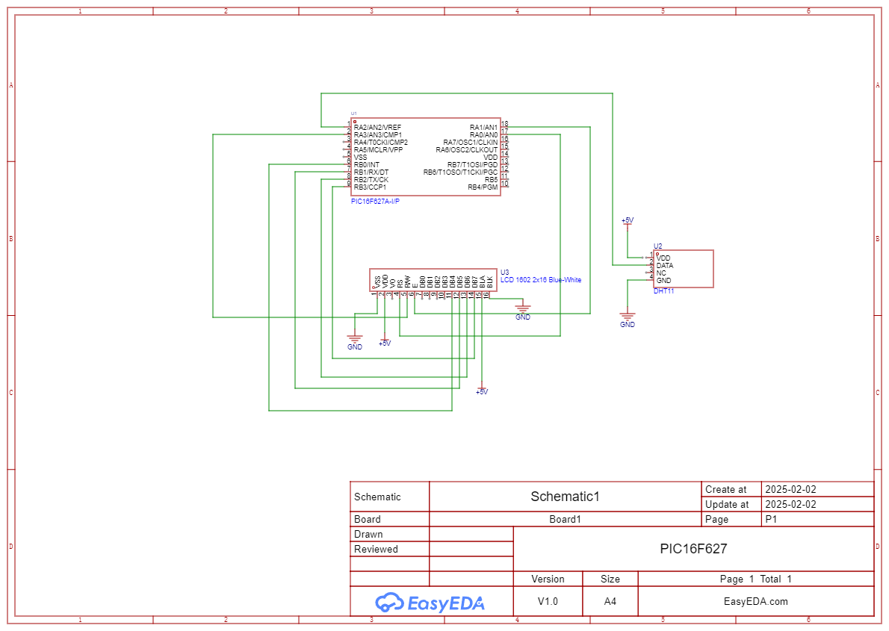

# PIC16F627 with DHT11 Sensor and 1602 LCD (4-Bit Mode). Assembly

 

A simple circuit demonstrating how to interface a PIC16F627 microcontroller with a DHT11 temperature/humidity sensor and a 1602 LCD in 4-bit mode. Includes a potentiometer for LCD contrast adjustment.

---

## Components
- **Microcontroller**: PIC16F627
- **Sensor**: DHT11 (Temperature/Humidity)
- **Display**: 1602 LCD (16x2 Character LCD, 4-bit mode)
- **Potentiometer**: 20kΩ (for LCD contrast)

- **Power Supply**: 5V DC

---

## Pin Connections
### PIC16F627 to DHT11
| PIC16F627 Pin | DHT11 Pin | Connection      |
|---------------|-----------|-----------------|
| `RA2`         | `DATA`    | Data line       |
| `VCC`         | `VCC`     | 5V power        |
| `GND`         | `GND`     | Ground          |

### PIC16F627 to 1602 LCD (4-Bit Mode)
| PIC16F627 Pin | LCD Pin | Function        |
|---------------|---------|-----------------|
| `RB0`         | `D4`    | Data Bit 4      |
| `RB1`         | `D5`    | Data Bit 5      |
| `RB2`         | `D6`    | Data Bit 6      |
| `RB3`         | `D7`    | Data Bit 7      |
| `RA0`         | `RS`    | Register Select |
| `RA1`         | `EN`    | Enable          |
| `RA3`         | `RW`    | Read/Write      |
| `VCC`         | `VCC`   | 5V power        |
| `GND`         | `GND`   | Ground          |

### LCD Contrast Adjustment
| Potentiometer Pin | Connection |
|-------------------|------------|
| Left              | `VCC`      |
| Middle            | `V0` (LCD) |
| Right             | `GND`      |

---

## Firmware
- The microcontroller reads data from the DHT11 sensor and displays it on the LCD.
- Written in Assembly using [pic-as (v3.0)](https://www.microchip.com/mplab/compilers).
- **Key Dependencies**:
  - `main.asm`

### How to Use
1. Compile the code with MPLAB X or your preferred IDE.
2. Flash the `.hex` file to the PIC16F627.
3. Power the circuit. The LCD will display temperature and humidity data.

---

## Schematic Details
- **EasyEDA Pro**: 

